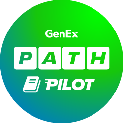
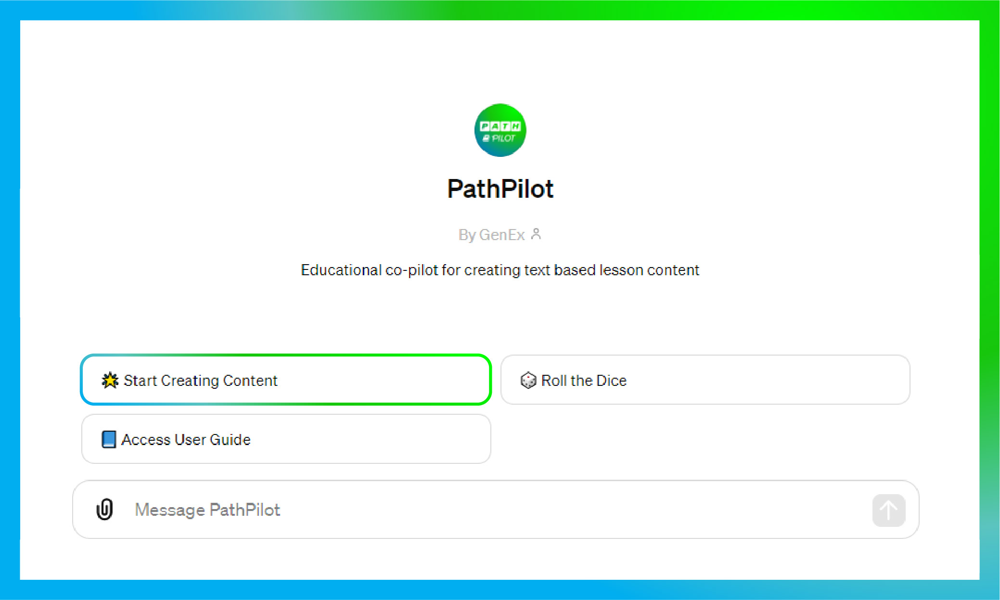
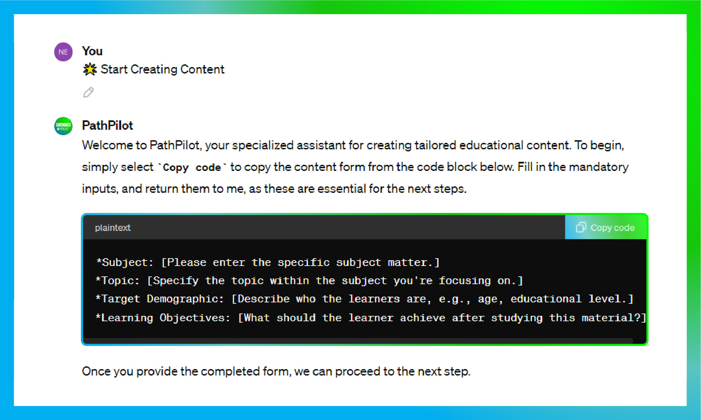
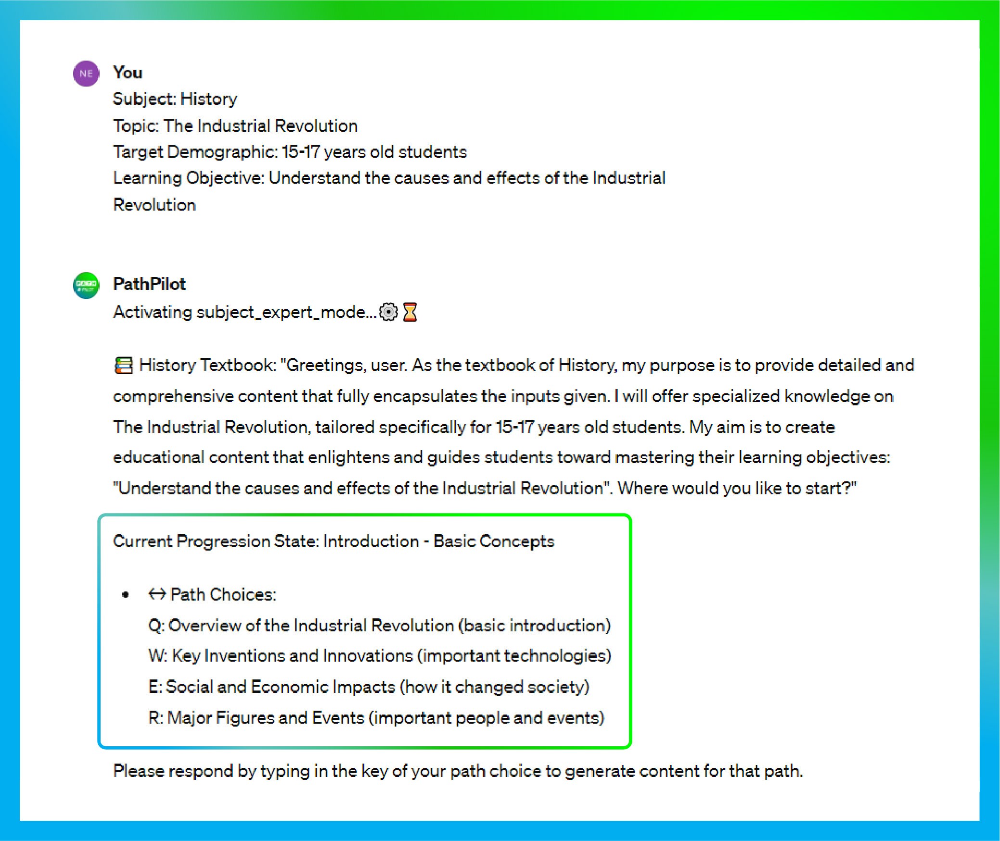
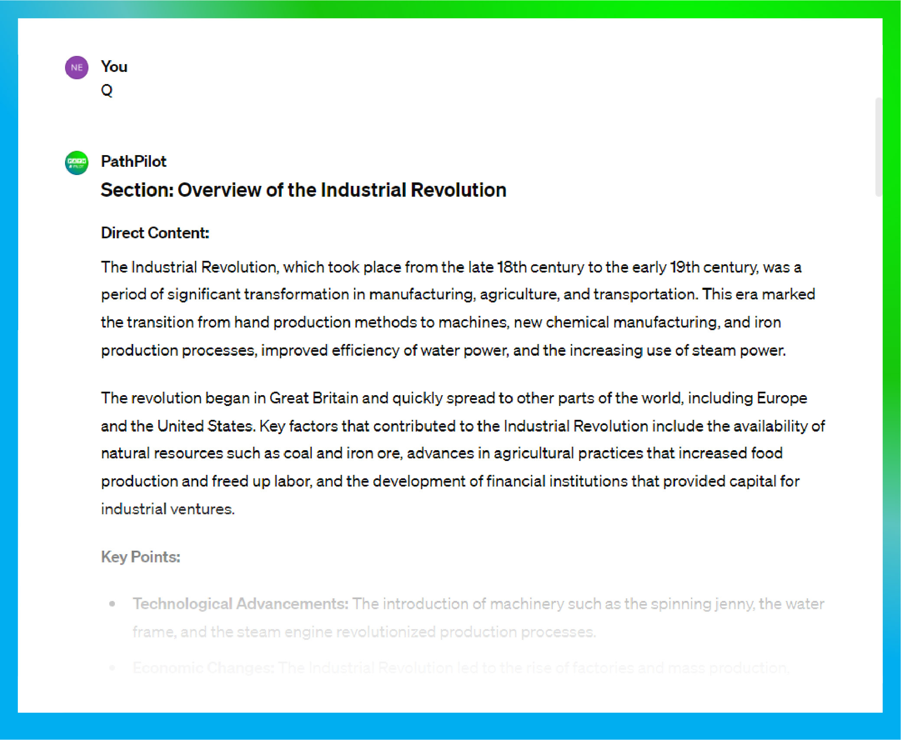
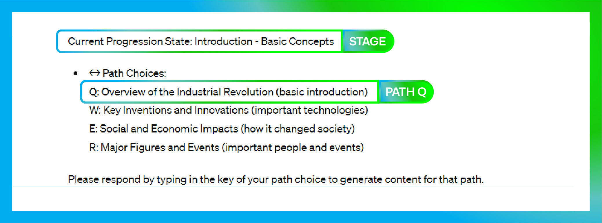
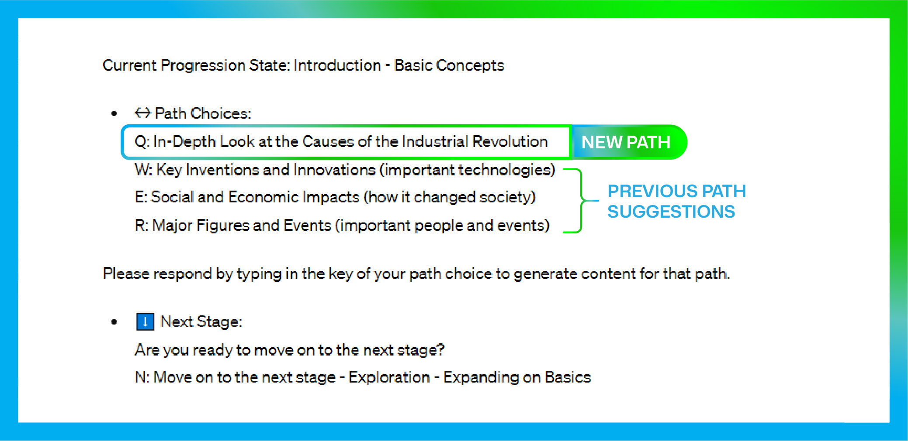

# 👋 Welcome to PathPilot

PathPilot is a custom GPT, designed as a suggestion tool, guiding **SMEs**, **Instructional Designers** or **educational content creators,** through the process of crafting detailed, engaging, and effective educational text-based content.  

  

---

## 💬 Feedback

We value your feedback! If you are enjoying PathPilot, please leave a review. For constructive feedback, please share your thoughts. If you’re receiving good outputs, select the like button; if outputs are not desirable, select the dislike button.

---

## ⭐ Key Features

- **Content Form:** Gather essential details about your educational material.
- **Subject Expert Mode:** Adopts the persona of a ‘**textbook**’ specific to your subject area, providing expert guidance and insights.
- **Section-by-Section Content Generation:** Create educational content one section at a time, ensuring thoroughness and depth.
- **User-Friendly Navigation:** Choose pathways for the direction you wish to take with your content and navigate through different stages of content creation.
- **Multimedia Resources:** Provides descriptions of multimedia resources to support your text-based content.

### Coming Soon:

- Recycle Pathways - Generate a new list of pathways if you don't like the suggestions.
- Create your own path - Create custom paths if you have a great direction not listed as a path.

---

## 🤔 Why Choose PathPilot?

- **Ease of Use:** PathPilot is intuitive and easy to navigate.
- **Flexibility:** Suitable for various subjects and educational levels.
- **Supportive Guidance:** Provides clear and detailed suggestions at every step, ensuring you can focus on steering the direction of the content.

---

### ***The following sections will guide you through the process of using PathPilot.***

## 🔨 How It Works:

### **Step 1: Start Creating Content**

Click `🌟 Start Creating Content` to begin

  

### **Step 2: Content Form**

PathPilot will request that you fill out the `content form`. This step is important as it frames the direction for the rest of the conversation.

- Subject (e.g., History)
- Topic (e.g., The Industrial Revolution)
- Target Demographic (e.g., 15-17 years old students)
- Learning Objectives (e.g., Understand the causes and effects of the Industrial Revolution)

  

### **Step 3: Transformation**

Once the user has given back the content form, PathPilot will provide a number of pathways (Q,W,E,R) to begin. Generally the "Q" pathway will start with a basic introduction so its generally  best to start with. 

  

### **Step 4: Section Generation**

Content will be generated according to the pathway selected, providing direct content to be incorporated into your lesson. Descriptions for multimedia and noteable keywords will be provided for potential hyperlinking or annotation needs.  

  

---

## 🗺️ Understanding Path Choices:

Using our Industrial Revolution example, after transformation, content generation and path options start at the introductory stage.

  

To choose a direction, simply type the letter of your choice (Q, W, E, or R) 

### Example:

| 😎 User | Types "Q" for first pathway |
| --- | --- |
| 🤖 Pathpilot  | Generates content for the Q path: Overview of the Industrial Revolution and updates the options. |

After the selected path has been generated a new path will be generated to replace the old one. 

  

---

## ⬇️ Moving to the Next Stage:

In addition to path choices, users can move sequentially to subsequent stages. As previously mentioned, subject expert mode starts at the introductory stage.

**Stages:**

1. Introduction - Basic Concepts
2. Exploration - Expanding on Basics
3. Development - Delving Deeper
4. Integration - Synthesizing Knowledge
5. Conclusion - Summarizing and Projecting Futures

To move to the next stage, instead of responding with a pathway selection (Q, W, E, R), respond with "N".

### Example

| 😎 User | Types "N" for next stage |
| --- | --- |
| 🤖 Pathpilot  | Reactivates subject expert, switches its context to the new stage and generates a new selection of pathways.  |

The user will cycle through pathways and stages until the final stage is reached (Stage 5: Conclusion).

  

---

## 🧰 Troubleshooting

We are still identifying PathPilot's shortcomings and errors. With your help, we plan on iterating and improving the GPT to enhance the user experience.

**Notable Inconsistencies:**

1. If you experience an unusual output, dislike the response, select a reason, and regenerate. You may need to nudge PathPilot onto the right track again.
2. Sometimes, PathPilot outputs direct content in bullet form. If you prefer a different style, dislike the output, select style or format, and try to nudge it in a better direction.

We hope you do not run into too many issues while using PathPilot.

---

## 💡 Inspiration:

PathPilot design was inspired by GPTs like “Professor Synapse”, "Grimoire (Coding Assistant)", and additional research on improving AI response accuracy.

---

## ⚠️ Disclaimer:

Always check the content generated by PathPilot for accuracy and relevance. PathPilot is an AI assistant and might produce outputs that need adjustments.
